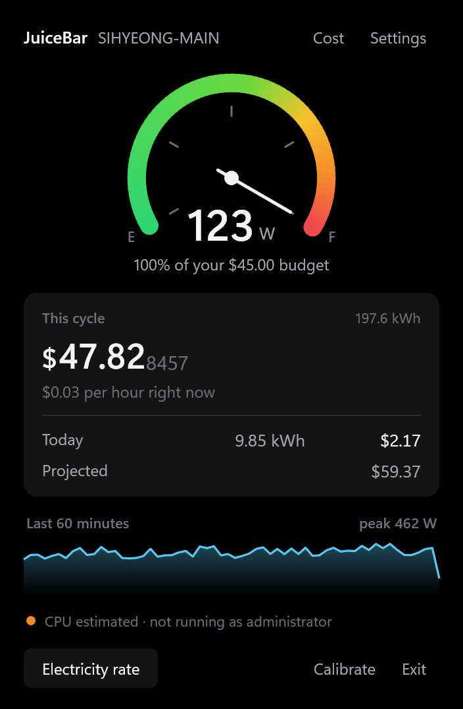
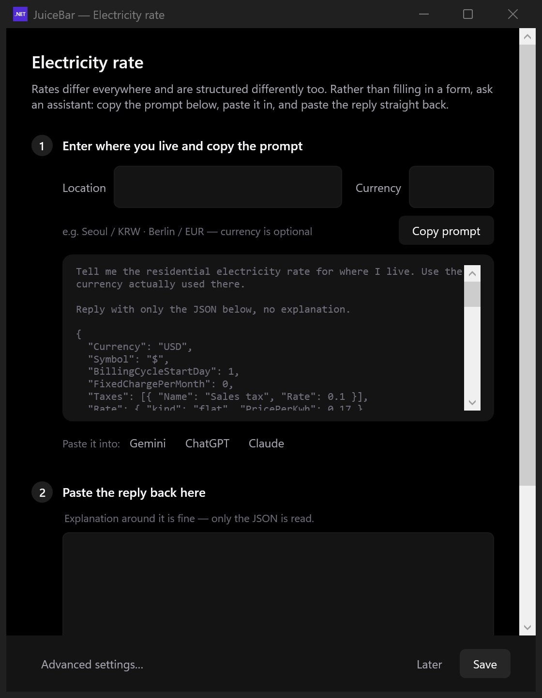
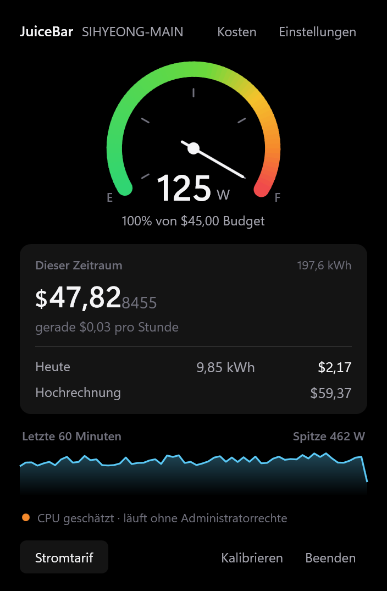
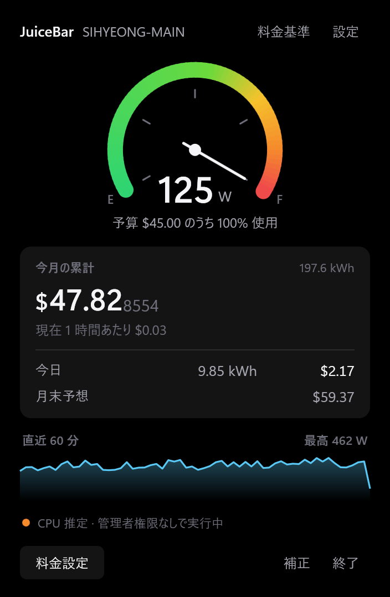

# JuiceBar

**A fuel gauge for your PC's electricity bill, in the Windows tray.**

[](https://github.com/writingdeveloper/JuiceBar/actions/workflows/build.yml)
[](https://github.com/writingdeveloper/JuiceBar/releases/latest)
[](LICENSE)

JuiceBar measures what your computer is actually drawing, turns it into money at
your local rate, and keeps a gauge in the tray that fills up as the billing
cycle goes on. Click it and the cost ticks upward in front of you.

<p align="center">
  
</p>

**[Download the latest release →](https://github.com/writingdeveloper/JuiceBar/releases/latest)**
One file, no installer, no .NET runtime required — and on most machines, no
kernel driver either. See [how accurate is it, really](#how-accurate-is-it-really).

---

## Why

A desktop with a decent GPU swings between 60 W idle and 600 W under load. That
gap is real money, and nothing on Windows shows it to you. JuiceBar makes it
visible without you having to go looking.

## Setting your rate takes one paste

Electricity tariffs differ everywhere and are structured differently too —
flat here, tiered there, time-of-use somewhere else, with standing charges and
taxes layered on top. Most people do not know their own tariff in that detail,
and a form with twenty fields is where good intentions go to die.

So JuiceBar writes the prompt for you.

<p align="center">
  
</p>

1. Type where you live. Add a currency if you want to pin one.
2. Press **Copy prompt** and paste it into Gemini, ChatGPT or Claude.
3. Paste the reply straight back.

The prompt pins down a fixed JSON schema, so the answer arrives in a shape
JuiceBar can read with nothing left to edit. Currency, symbol, billing day,
standing charge, taxes and the whole rate structure all land in that one paste.
Explanation around the JSON is fine — only the JSON is read.

What comes back is checked before it is accepted. A tax rate written as `10`
instead of `0.1`, a final tier with an upper bound, tiers out of order, a
billing day of 45 — each is rejected with a message saying what is wrong,
rather than silently producing a bill ten times too large.

Then JuiceBar asks for the one thing an assistant cannot know: your monthly
budget. That is the whole setup.

> Rather type it yourself? **Show current settings** drops the active tariff
> into the same box as JSON, ready to edit. Starting points for several
> countries live in [`tariffs/`](tariffs/).

---

## How accurate is it, really

This is the part worth being precise about.

Windows does not report your computer's power consumption. There is no API for
it. What hardware sensors report is the power of individual components:

| Component | Source | Available |
|---|---|---|
| CPU package | Windows energy meter (EMI) | most Windows 10/11 machines, no driver, no admin |
| CPU package | Intel RAPL / AMD SMU, via PawnIO | fallback where the meter is absent |
| Discrete GPU | NVIDIA NVML / AMD ADL | always |
| Battery charge and discharge | ACPI | laptops only |
| Motherboard, RAM, drives, fans | — | never measurable |
| Power supply losses | — | never measurable |

So the rest is modelled:

```
P_wall = (P_measured + B) / η

  P_measured : the sensors above, summed
  B          : constant draw of the parts nothing can measure
  η          : power supply efficiency
```

`B` and `η` differ from machine to machine, so JuiceBar works them out for your
hardware instead of guessing.

**On a laptop, nothing to do.** While running on battery, the discharge rate
*is* the true whole-system power. JuiceBar compares it against the sensor sum,
learns `B` on its own, and applies what it learned once you plug back in.

**On a desktop, two numbers.** Open the calibration window and enter what a
plug-in wattmeter or an energy-monitoring smart plug reads — once while idle,
once under load. Two points, two unknowns, solved exactly. That takes the error
from roughly ±15% down to about ±5%.

Without calibration JuiceBar uses conservative defaults and labels the reading
*not calibrated*, so you know how far to trust it.

### Things that quietly go wrong, and don't here

**Integrated graphics get counted twice.** An iGPU sits inside the CPU package,
so its power appears in `CPU Package` *and* again as `GPU Core` / `GPU SoC`. On
a Ryzen 9 7950X that is 46 W of draw that is not there. JuiceBar excludes
integrated GPUs by default — and because sensor naming varies by hardware and no
heuristic will be right everywhere, the settings window shows every channel with
a running total so you can see the double count and switch it off.

**Reading the CPU normally costs you a kernel driver.** Package power lives in
model-specific registers, and every tool that reads them — LibreHardwareMonitor
included — needs a ring-0 driver plus administrator rights to get at them. Miss
either and the CPU reads 0 W, which is half of a desktop's draw.

JuiceBar takes a different route first. Windows exposes the same RAPL counters
through the [Energy Meter Interface](https://learn.microsoft.com/en-us/windows-hardware/drivers/powermeter/energy-meter-interface),
a documented user-mode API served by the platform's own power-management driver.
Measured on a Ryzen 9 7950X with no driver installed and no elevation:

```
LibreHardwareMonitor  "CPU Package"           0.00 W
Windows energy meter  "RAPL_Package0_PKG"    66.61 W
```

Same counter, no driver, no UAC prompt. It also reports *accumulated energy*
rather than instantaneous power, so spikes between polls land in the total
instead of being missed.

[PawnIO](https://pawnio.eu/) — the signed, open-source driver
LibreHardwareMonitor uses — remains the fallback for hardware that exposes no
energy meter, and JuiceBar only suggests installing it when it is actually
needed. Where neither is available the CPU share is estimated from utilisation,
and the badge in the popup says so plainly rather than pretending otherwise.

> The driver PawnIO replaced, WinRing0, is on Microsoft's vulnerable-driver
> blocklist. JuiceBar never ships it.

**Both sources can read the same watts.** With PawnIO installed, the energy
meter and LibreHardwareMonitor report the *same* RAPL counter. Adding them would
double the CPU figure exactly. JuiceBar picks one — the meter, when it is
actually reporting — and drops the other.

**A stale total outlives its cause.** Change tariff, or leave the app running
while you test something, and this cycle's total no longer means anything.
Settings has **Reset this cycle**, which clears what has piled up since the
cycle started and leaves earlier cycles alone.

---

## Languages

English, 한국어, 日本語, 简体中文, Español and Deutsch. JuiceBar follows your
Windows display language by default and can be switched in settings; numbers and
dates follow the chosen language too.

<p align="center">
  
  
</p>

The prompt sent to the assistant is translated as well, while the JSON schema
inside it stays identical in every language — that part is read by a machine.

Adding a language means adding one JSON file under
[`src/JuiceBar.Core/Localization/strings/`](src/JuiceBar.Core/Localization/strings/)
and listing it in `Loc.Available`. A test checks that every language has exactly
the same keys and placeholders as English, so translations cannot drift out of
sync unnoticed.

---

## Updates

JuiceBar checks GitHub Releases once a day and offers the new version in the
popup. Accepting it downloads the executable and restarts into it — there is no
installer to run, because there was none to begin with.

Windows will not let a running executable be overwritten, but it will let one be
renamed. So the current file moves aside to `JuiceBar.exe.old`, the new one takes
its place, and the leftover is deleted on the next start. If anything fails
midway the old file moves back, so a failed update leaves a working app rather
than a broken one.

Two checks happen before anything is written: the download URL must be on a
GitHub host, and the file must match the published size and actually be a
Windows executable. Otherwise the update is refused and you are pointed at the
release page.

Turn it off in settings if you would rather update by hand.

---

## Footprint

A power meter that wasted power would be a poor joke, so this was measured
rather than assumed. JuiceBar polls sensors once a second and writes one row per
minute. Two things were fixed once the numbers came in:

- **LibreHardwareMonitor keeps a rolling history of every sensor value in
  memory.** For an app that stays open for days that grows without bound, and
  JuiceBar keeps the history it actually needs in SQLite anyway. Switching it off
  cut private memory from 213 MB to about 130 MB.
- **The cycle and daily totals were re-queried every second.** Over a month of
  minute rows that is a full scan per second for numbers that change once a
  minute. They are cached now, with the unwritten current minute added on top so
  the display still moves smoothly.

Ten minutes of sampling afterwards: memory flat at 126–131 MB, handles flat,
GDI objects flat at 37.

---

## Multiple machines

Each machine runs its own copy and keeps its own everything — calibration,
channel selection, history, tariff, language. No server, no account, nothing to
sign into. Copy the executable to a laptop and it starts a fresh profile keyed to
that machine.

Data lives in `%APPDATA%\JuiceBar\devices\<machine-id>\`. Delete that folder to
start over.

---

## Building

Requires the [.NET 10 SDK](https://dotnet.microsoft.com/download).

```
dotnet build -c Release
dotnet test

dotnet publish src/JuiceBar -c Release -r win-x64 --self-contained \
  -p:PublishSingleFile=true \
  -p:IncludeNativeLibrariesForSelfExtract=true \
  -p:EnableCompressionInSingleFile=true \
  -o publish
```

That produces a single ~75 MB `JuiceBar.exe` needing no .NET runtime installed.
Without compression it is 172 MB.

### Layout

```
src/JuiceBar.Core     sensors, calibration, energy integration, tariffs,
                      storage, updates, translations
src/JuiceBar          WPF tray application
tests/JuiceBar.Tests  everything that doesn't need hardware — 139 tests
tools/SensorProbe     console utility that dumps what your machine reports
```

`tools/SensorProbe` is the first thing to run when sensors misbehave. It prints
every power sensor LibreHardwareMonitor can see, which tells a missing driver
apart from a bad channel selection.

Setting `JUICEBAR_PIN_POPUP=1` opens the popup at startup and stops it closing
when it loses focus, which makes it possible to screenshot and iterate on the UI.

Releases are cut by tagging: `git tag v1.2.3 && git push --tags` builds, tests,
publishes and attaches the executable. The version lives in
`Directory.Build.props` and must match the tag.

---

## Licence

MIT. See [LICENSE](LICENSE) and [THIRD-PARTY-NOTICES.md](THIRD-PARTY-NOTICES.md).

Contributions welcome — especially tariff presets for more countries and
translations.
